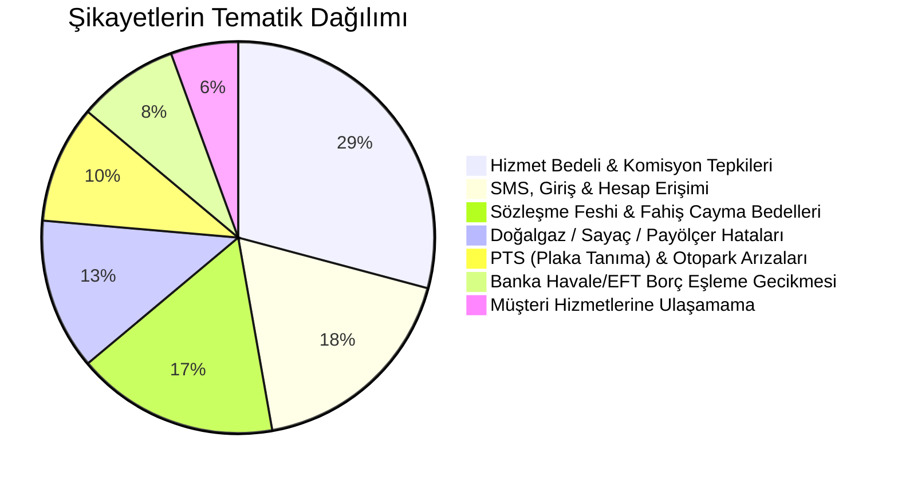
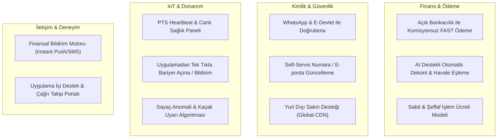

# Apsiyon Şikayet Analizi ve Ürün Geliştirme Yol Haritası (Product Roadmap)

Bu rapor, [Şikayetvar - Apsiyon](https://www.sikayetvar.com/apsiyon) sayfasından kazınan **144 şikayet verisinin** metin madenciliği ve kök neden analiziyle incelenmesi sonucunda hazırlanmıştır. 

Apsiyon platformunun müşteri kaybını önlemek, Şikayetvar puanını yükseltmek ve kullanıcı memnuniyetini maksimize etmek için **düzeltmesi gereken hatalar**, **yeniden tasarlaması gereken iş mantıkları** ve **geliştirmesi gereken yeni özellikler** 4 ana modülde toplanmıştır.

---

## 1. Yönetici Özeti ve Şikayet Dağılımı

144 şikayet incelendiğinde en çok tepki çeken ve kullanıcıları mağdur eden alanlar şu şekildedir:

---

## 2. Hata Veren ve Yanlış Çalışan Kısımlar (Bugs & Failures)

### 2.1. SMS Doğrulama ve Hesap Kilitlenmesi (Critical Auth Bug)
- **Sorun:** Kullanıcılar telefon numarası değiştirmek istediğinde doğrulama SMS'i eski numaraya gitmeye devam ediyor veya yeni numaraya hiç ulaşmıyor.
- **Sonuç:** Kullanıcı dairesine ait borçları göremiyor, aidatını ödeyemiyor ve temerrüde düşerek haksız gecikme faizi ödüyor.
- **Kök Neden:** Kimlik doğrulama servisinin (Auth service) GSM sağlayıcıları ile entegrasyonunda failover (yedekli gateway) olmaması ve telefon güncelleme akışında eski session/cache'in düşmemesi.

### 2.2. Banka Havale/EFT Mutabakat Gecikmesi ve Haksız Faiz (Reconciliation Bug)
- **Sorun:** Kat sakini aidatını veya yakıt bedelini bankadan EFT/Havale ile günü gününe ödüyor; ancak Apsiyon sisteminde borç 3 ila 30 gün boyunca silinmiyor ve sistem otomatik gecikme faizi işletmeye devam ediyor.
- **Sonuç:** Sakinler icra tehdidi ve yönetimle gerginlik yaşıyor ("Ödediğim paranın faizini ödüyorum").
- **Kök Neden:** Banka hareketlerinin (MT940/API) Apsiyon muhasebe modülüne otomatik yansımaması, işlem açıklamalarının regex ile parse edilememesi ve yönetici manuel onayına bağımlı kalması.

### 2.3. Plaka Tanıma Sistemi (PTS) Donanım/Yazılım Senkronizasyon Kaybı
- **Sorun:** Güncelleme sonrasında veya keyfi olarak yıllardır aynı sitede oturan araç sahiplerinin plakaları aniden okunmamaya başlıyor; bariyer açılmıyor, kapıda 15-20 dakikalık kuyruklar oluşuyor.
- **Sonuç:** Site sakinleri site yönetimini, site yönetimi de Apsiyon'u suçluyor; donanım kiralama bedeli ödendiği halde hizmet alınamıyor.
- **Kök Neden:** PTS uç birimlerindeki (Edge/Kamera) lokal veritabanı ile Apsiyon bulut veritabanı arasındaki veri senkronizasyonunun kopması ve çevrimdışı (offline) toleransının olmaması.

### 2.4. Isınma / Payölçer Hatalı Formül ve Çarpan Problemleri
- **Sorun:** Merkezi sistem ısı payölçer okumalarında hatalı katsayı veya endeks kullanımı nedeniyle dairelere 4.000 TL – 7.000 TL gibi absürt faturalar çıkarılıyor.
- **Sonuç:** Sitede kaos ortamı oluşuyor, itirazlar incelenene kadar fatura faiz işletiyor.

---

## 3. Yanlış Kurgulanan İş Mantıkları ve Kullanıcı Tepkileri

### 3.1. Orantısız ve Değişken "Hizmet Bedeli" (Komisyon) Politikası
- **Kullanıcı Tepkisi:** *"Zaten 10.000 TL aidat ödüyorum, Apsiyon kartla ödeme yaparken benden ekstra %5-7 (150-330 TL) hizmet bedeli kesiyor. Yazılımın 1.000 TL ile 10.000 TL işleminde yaptığı iş aynı değil mi?"*
- **Algı:** Kullanıcılar Apsiyon'u aracı tefeci gibi algılamaya başlıyor. Hizmet bedelinin ödeme ekranında şeffaf olarak önceden ayrıştırılmaması öfkeyi katlıyor.

### 3.2. Habersiz Geriye Dönük Borçlandırma
- **Kullanıcı Tepkisi:** Kat sakinlerine hiçbir push bildirim veya SMS gönderilmeden geriye dönük ek bütçe veya aidat zammı yansıtılıyor; kullanıcı uygulamaya girdiğinde "gecikmiş borç" ile karşılaşıyor.

### 3.3. Fahiş Cayma Bedelleri ve Fesih Zorluğu
- **Yönetici Tepkisi:** Bir yıl içinde 3 defa zam yapılmasına rağmen ayrılmak isteyen site yönetimlerine 36 aylık cayma bedeli çıkarılıyor; telefonla iptal talebi alınmasına rağmen aylar sonra fatura kesilmeye devam ediliyor.

---

## 4. Geliştirilmesi Gereken Özellikler (Feature Recommendations)

### 1. Finans & Ödeme Modülü İyileştirmeleri

#### Özellik 1: Açık Bankacılık (Open Banking) FAST ile Anında Komisyonsuz Ödeme
- **Nasıl Çalışacak:** Kat sakini kart komisyonu ödemek istemediğinde, Apsiyon ekranından kendi bankasını seçerek FAST/Kolay Adres protokolüyle **sıfır komisyonla** ödeme yapabilecek.
- **Fayda:** Kullanıcının kart komisyonu öfkesi tamamen ortadan kalkar; para anında site hesabına geçer.

#### Özellik 2: AI / OCR Destekli Otomatik Havale & Dekont Eşleme Motoru
- **Nasıl Çalışacak:** Sakin bankadan EFT yaparken açıklama kısmına otomatik daire kodu yazar veya mobil uygulamaya dekontun fotoğrafını yükler. OCR motoru saniyeler içinde tutarı, IBAN'ı ve tarihi eşleyerek borcu anında sıfırlar ve faiz işletimini durdurur.
- **Fayda:** Günlerce süren "Borcum silinmedi" şikayetleri %100 biter.

#### Özellik 3: Şeffaf Fiyatlandırma ve Tavan Komisyon Sınırı
- **Nasıl Çalışacak:** Yüzdelik fahiş komisyon yerine, banka takas maliyetini aşmayan makul ve tavan sınırı (Cap) olan bir işlem ücreti kurgulanmalı. Ödeme ekranında `Aidat: 3.000 TL | Banka İşlem Ücreti: 19 TL` şeklinde şeffaf döküm verilmeli.

---

### 2. Kimlik Doğrulama & Hesap Yönetimi (Auth & Profile)

#### Özellik 4: Çok Kanallı Doğrulama (Multi-Channel Auth Fallback)
- **Nasıl Çalışacak:** SMS gitmediğinde sistem 45 saniye sonra otomatik olarak **WhatsApp Doğrulama Kodu** veya **E-posta Doğrulama Linki** sunmalı.
- **Fayda:** SMS operatör kaynaklı erişim krizleri sıfıra iner.

#### Özellik 5: Self-Servis Numara Güncelleme ve Daire İçi Rol Yönetimi
- **Nasıl Çalışacak:** Eski telefonuna erişemeyen kullanıcılar için; daire yöneticisinin onay vermesiyle veya e-Devlet kapısı doğrulamasıyla tek tıkla yeni numara tanımlanabilmeli. "TC kayıtlı / numara zaten var" deadlock durumu çözülmeli.

#### Özellik 6: Yurt Dışı Sakin Erişimi (Global CDN & Uluslararası Gateway)
- **Nasıl Çalışacak:** Lüksemburg, Almanya gibi ülkelerde yaşayan mülk sahipleri için Cloudflare/AWS CloudFront kuralları esnetilmeli, `ERR_CONNECTION_TIMED_OUT` hataları giderilmeli ve uluslararası ülke kodlarına (+352, +49) sorunsuz SMS routing yapılmalı.

---

### 3. IoT, Donanım & Saha Operasyonları (PTS & Sayaç)

#### Özellik 7: PTS Otomatik Teşhis (Heartbeat & Health Dashboard)
- **Nasıl Çalışacak:** Otoparktaki kamera veya kontrol ünitesi her 60 saniyede bir merkeze sinyal (heartbeat) göndermeli. Bağlantı koptuğunda hem site yönetimine hem Apsiyon teknik saha ekibine anında push bildirim düşmeli.
- **Fayda:** 3 ay boyunca arızalı kalan ve fark edilmeyen PTS skandalları engellenir.

#### Özellik 8: Mobil Uygulamadan "Bariyer Açılmadı / Geçici İzin" Butonu
- **Nasıl Çalışacak:** Kamera plakayı okumadığında, sakin uygulamadan tek tuşla GPS konumu teyidiyle bariyeri tetikleyebilmeli veya güvenlik kulübesine anlık "Kayıtlı Plaka Teyidi" uyarısı gönderebilmeli.

#### Özellik 9: Isı Payölçer & Sayaç Anomali Algılama Algoritması
- **Nasıl Çalışacak:** Bir dairenin yakıt/su faturası, bloğun veya sitenin medyan tüketim değerinin 3 katını aştığında sistem faturayı yöneticiye onaylatmadan yayınlamamalı; "Anomali Uyarısı: 12 No'lu dairede beklenmedik yüksek tüketim tespit edildi, sayacı kontrol edin" uyarısı vermelidir.

---

### 4. İletişim, Hukuk ve Şeffaflık Sistemi

#### Özellik 10: Finansal Olay Bildirim Motoru (Event-Driven Notifications)
- **Nasıl Çalışacak:** Daireye eklenen her yeni borç, ek bütçe kararı veya gecikme uyarısında eş zamanlı olarak Push Bildirim + E-posta gönderilmeli. Sakinin uygulamayı açmadığı durumlarda "haberim yoktu" mağduriyeti önlenmeli.

#### Özellik 11: Site Yönetimleri İçin Şeffaf Sözleşme & İptal Portalı
- **Nasıl Çalışacak:** Yönetici panelinde sözleşmenin başlangıç-bitiş tarihleri, taahhüt koşulları, fesih bildirim süresi ve cayma bedeli hesaplama sihirbazı açıkça yer almalı. Keyfi fiyat artışları sözleşme şartlarına bağlanarak güven tazelenmeli.

---

## 5. Uygulama Önceliklendirme Matrisi (Impact vs. Effort)

| Öncelik | Modül / Özellik | Etki (Impact) | Efor (Effort) | Şikayet Azaltma Potansiyeli |
|:---:|---|:---:|:---:|:---:|
| **P0 (Kritik)** | SMS / WhatsApp Çok Kanallı Giriş & Numara Güncelleme | Çok Yüksek | Düşük | %25 |
| **P0 (Kritik)** | Otomatik Dekont / Havale Eşleme ve Haksız Faiz Durdurma | Çok Yüksek | Orta | %20 |
| **P1 (Yüksek)** | Açık Bankacılık (FAST) Komisyonsuz Ödeme & Şeffaf Ücret | Çok Yüksek | Orta | %30 |
| **P1 (Yüksek)** | PTS Çevrimdışı Mod & Otomatik Sağlık Kontrolü (Heartbeat) | Yüksek | Orta | %10 |
| **P2 (Orta)** | Payölçer / Sayaç Tüketim Anomali Algılama | Yüksek | Yüksek | %8 |
| **P2 (Orta)** | Şeffaf Sözleşme, Taahhüt ve Self-Servis Fesih Portalı | Orta | Düşük | %7 |
